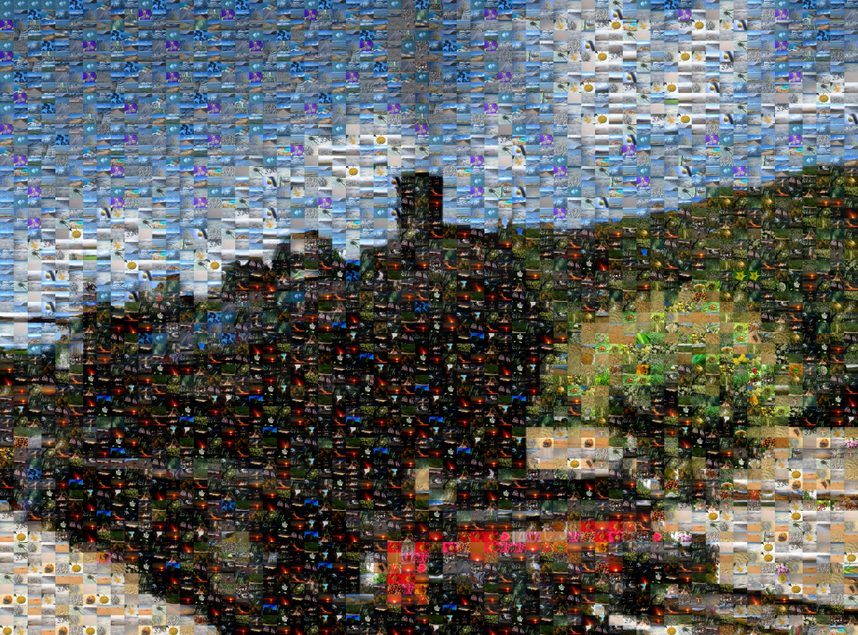

# NWJS App to create Photo Mosaics

This is a little rough around the edges. You need to download the nwjs runtime from http://nwjs.io in order to run this app (unless you want to tinker around even more). You need to have ImageMagick installed; on Windows, you will need to specify the path to the imagick.exe in the main.js file. You will probably have to increase the memory and size limits of ImageMagick as soon as you're trying to generate higher resolution mosaics. In case of errors, the Chrome Dev Console is a good place to start. Good luck!